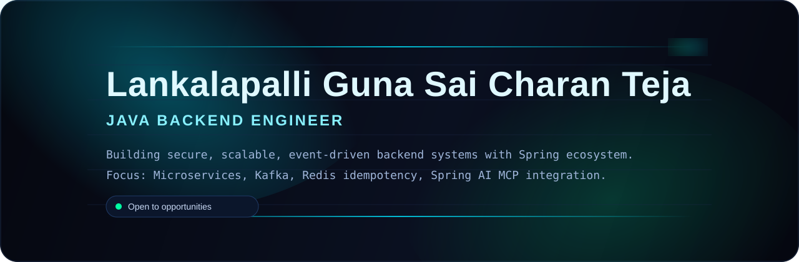
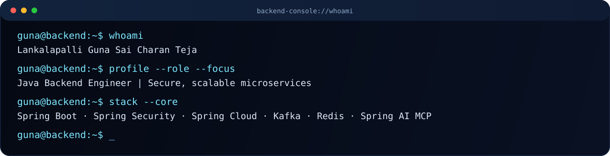
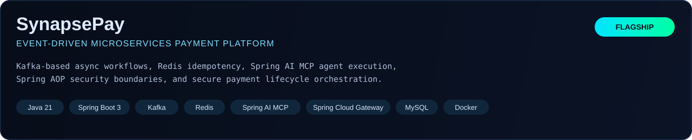
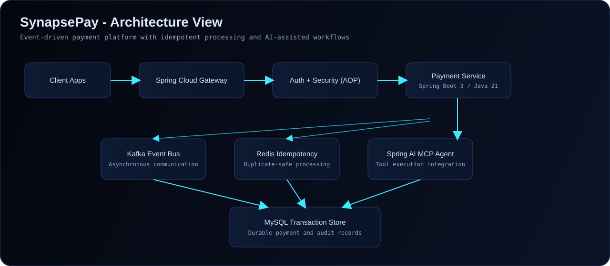
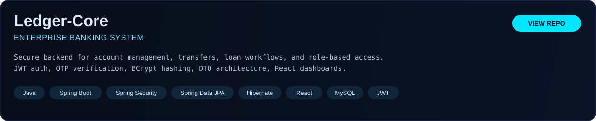
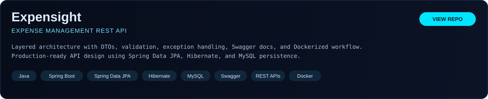
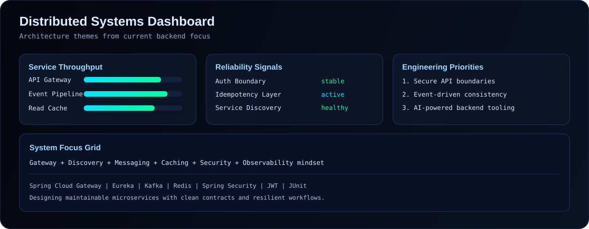
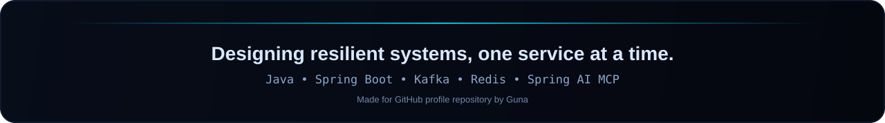

<p align="center">
	
</p>

<p align="center">
	
</p>

<p align="center">
	<a href="https://git.io/typing-svg">
		
	</a>
</p>

<p align="center">
	<a href="https://github.com/guna2007">GitHub</a>
	·
	<a href="https://linkedin.com/in/guna-lankalapalli">LinkedIn</a>
	·
	<a href="https://guna-portfolio-teal.vercel.app/">Portfolio</a>
	·
	<a href="https://leetcode.com/u/guna_lankalapalli">LeetCode</a>
</p>

<p align="center">
	
</p>

## whoami

<p align="center">
	
</p>

```bash
name: Lankalapalli Guna Sai Charan Teja
preferred_name: Guna
role: Java Backend Engineer
education: B.Tech CSE (AI), IIITDM Kancheepuram (Aug 2024 - Jun 2028)
cgpa: 9.22
focus: secure, scalable, resilient backend and cloud architectures
specialization: Java, Spring Boot, Spring Security, Spring Cloud, Kafka, Redis, Spring AI (MCP)
```

## About Me

Computer Science undergraduate specializing in backend and cloud architectures using Java, Spring Boot, Spring Security, Spring Cloud, Kafka, Redis, and Spring AI.

Experienced in building event-driven microservices, implementing distributed idempotency using Redis, and integrating AI agent tool execution using the Model Context Protocol (MCP).

Passionate about designing secure, scalable, resilient, and maintainable backend systems.

## Current Mission

- Build production-grade Java microservices with event-driven workflows.
- Strengthen distributed consistency with Kafka and Redis idempotency patterns.
- Advance secure API architecture using Spring Security, JWT, and RBAC.
- Integrate intelligent backend tooling via Spring AI MCP.

<p align="center">
	
</p>

## Featured Projects

<p align="center">
	
</p>

<p align="center">
	
</p>

<p align="center">
	
</p>

<p align="center">
	
</p>

## Distributed Systems Dashboard

<p align="center">
	
</p>

## Tech Stack

### Languages

<p>
	
</p>

`SQL`

### Backend

`Spring Boot` · `Spring Security` · `Spring Data JPA` · `Hibernate` · `Spring Cloud` · `Spring AI (MCP)` · `REST APIs` · `JWT Authentication` · `Node.js` · `Express.js`

### Microservices & Messaging

`Apache Kafka` · `Redis` · `Eureka Service Discovery` · `Spring Cloud Gateway` · `OpenFeign`

### Frontend

<p>
	
</p>

`Thymeleaf`

### Databases

<p>
	
</p>

### Tools

<p>
	
</p>

`JUnit`

<p align="center">
	
</p>

## Competitive Programming

- LeetCode Knight
- Peak Rating: 1810
- Top 7.9% Globally
- Solved 600+ Problems
- CodeChef 2★
- Rank 374 in CodeChef Starters 225
- 120+ day LeetCode streak

## Leadership

- Core Member, CS Club (Software Wing)
- Joint Core Member, CS Club (Edith Wing)
- Conducted 5+ technical workshops for 100+ students

## GitHub Analytics

<p align="center">
	
	
</p>

<p align="center">
	
</p>

## Activity Graph

<p align="center">
	
</p>

## GitHub Snake

<p align="center">
	
</p>

## Contact

- Email: [lankalapalligunapersonal@gmail.com](mailto:lankalapalligunapersonal@gmail.com)
- Phone: +91 6302328676
- GitHub: [github.com/guna2007](https://github.com/guna2007)
- LinkedIn: [linkedin.com/in/guna-lankalapalli](https://linkedin.com/in/guna-lankalapalli)
- Portfolio: [guna-portfolio-teal.vercel.app](https://guna-portfolio-teal.vercel.app/)
- LeetCode: [leetcode.com/u/guna_lankalapalli](https://leetcode.com/u/guna_lankalapalli)

<p align="center">
	
</p>

<p align="center">
	
</p>
